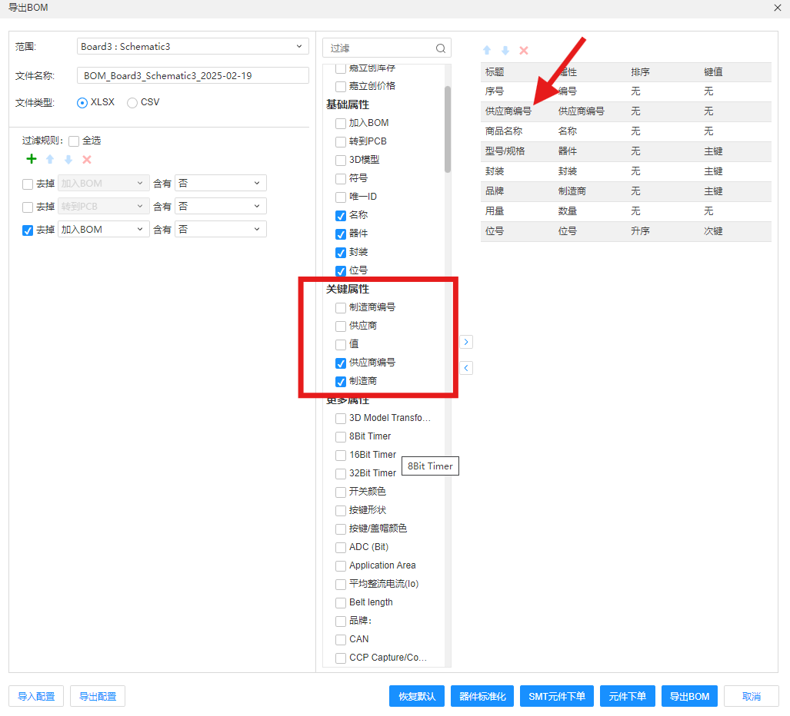
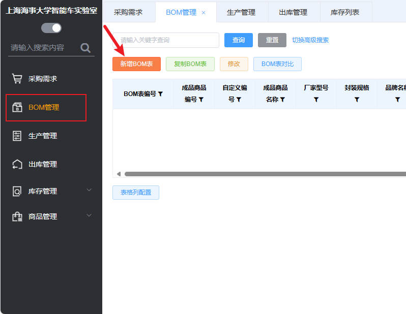
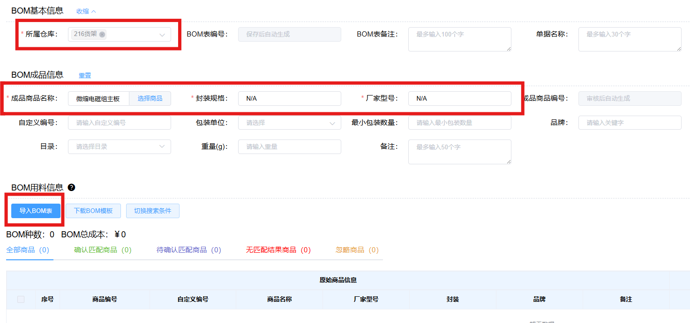
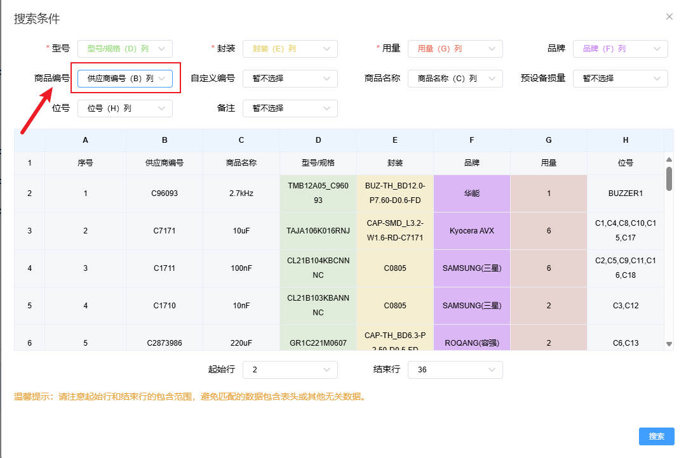
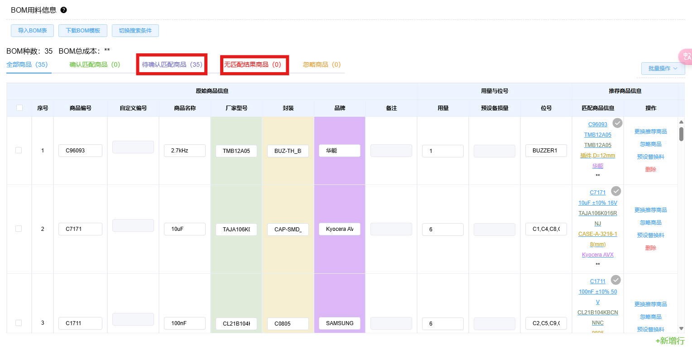
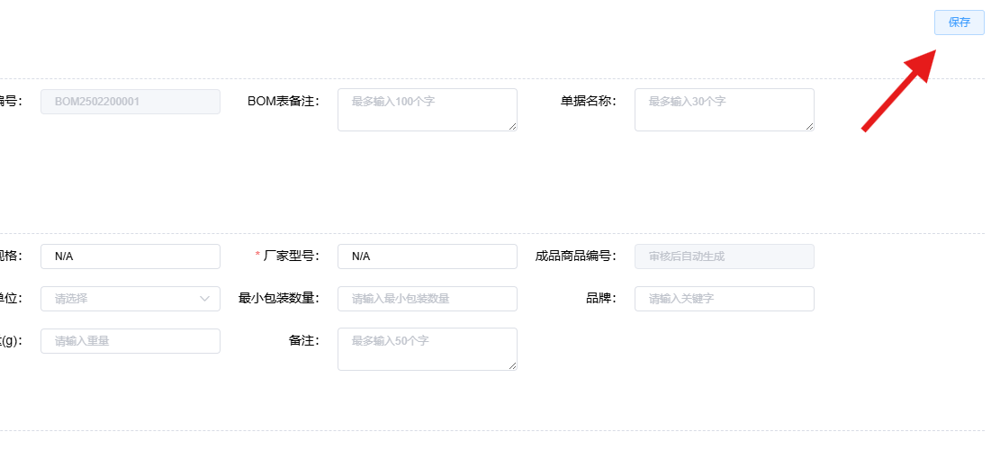

# 在立创ERP中添加BOM

!!! Tip
    BOM (Bill of Material)是电子行业用于描述产品构成物料的清单。

## 导入立创EDA导出的BOM

### 导出BOM时的建议 
在立创EDA导出BOM时，勾选供应商编号，导出的BOM中就会有供应商编号列（立创商城商品编号）。

!!! Tip
    BOM表中有立创商城商品编号将会简化后续导入流程。

### 开始导入BOM
在您的ERP主界面的左边栏点击**BOM管理**，进入到BOM管理界面，随后点击**新增BOM表**，开始添加BOM表。

在新增BOM界面，**所属仓库**请选择216货架；**成品商品名称**请以“组别”+“具体PCB名称命名”，例如“微缩电磁组主板”；**封装规格**以及**厂家型号**建议填写“N/A”。随后点击导入**导入BOM表**选择您的BOM文件。

如果同一PCB有不同版本，请在后方加上版本号，如“微缩电磁组主板V2.0”。

在导入BOM表界面，**型号**、**封装**、**用量**列通常会自动匹配，若没有自动匹配请手动选择对应列，若没有找到对应的列请检查BOM是否正确导出。其他列可能也会自动匹配，但非必须匹配列，若未自动匹配不会影响BOM导入。

建议选择**商品编号**为供应商编号列（即导出BOM时的立创商品编号）。

随后点击**搜索**进入BOM元件匹配阶段。

如果导出BOM时导出供应商编号列，并在导入BOM时正确选择了商品编号列为供应商编号，大概率所有元件都能被正常匹配，此时***无匹配结果商品**数量应该为零。如果担心系统匹配的正确性的话，可以自行对照**匹配商品信息**与BOM表中的元件信息是否对应。如果存在**无匹配结果商品**，则请人工选择元件进行匹配。

!!! Tip
    如果在立创EDA设计原理图时选择的元件有误，在此不会有任何提示，请自行检查原理图设计时选择的元件型号正确！

最后就可以保存您的BOM表了。点击页面右上角的保存即可保存。

!!! Tip
    我们将会对您的BOM进行初步审核，请耐心等待。

  

