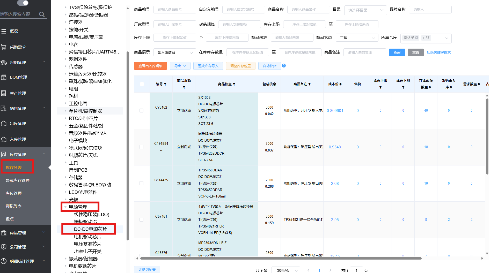
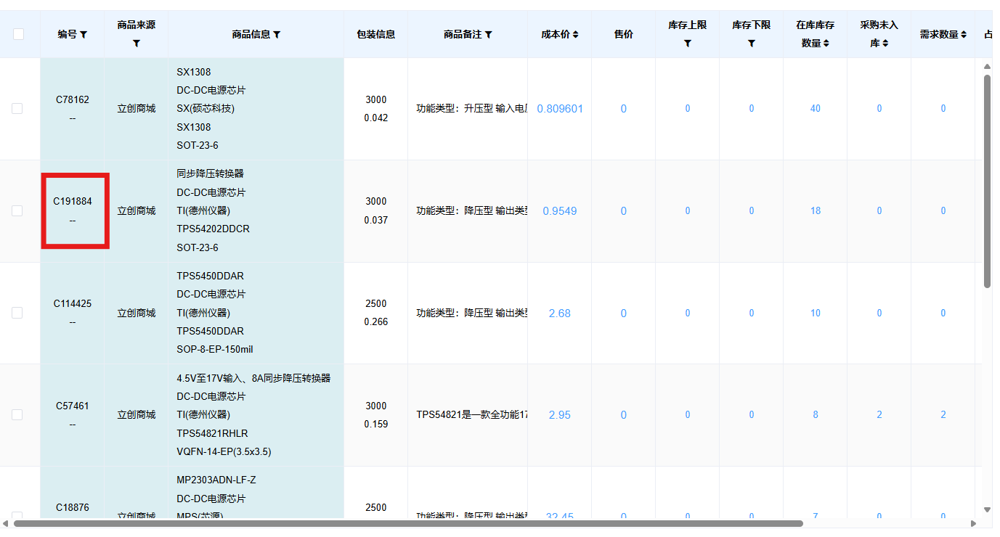
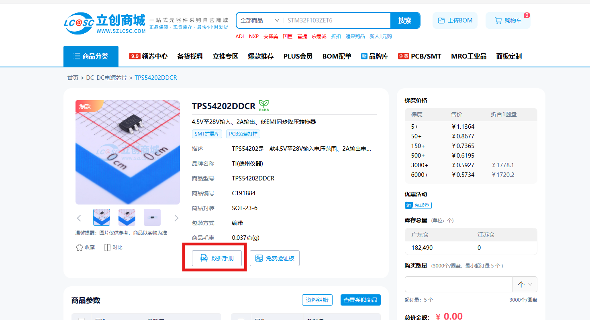

# 在设计时的建议

为了减少采购浪费，建议各位同学在原理图设计时，选取库内已有的元件进行设计。

例如我们要设计一路DC-DC电源，我们可以先去库存列表查询一下，实验室的库存内有哪几款DC-DC芯片？

点击**库存管理**侧边栏下的**库存列表**，即可查询实验室所有元件的已有库存。在库存管理页面中，左半部分是库存元件的类别，若选中相应类别，则只会显示对应类别下的元件库存。在本例中，我们要寻找一款DC-DC电源芯片，那么我们就选择在电源管理类别下的DC-DC电源芯片子类，就可以看到实验室库存中所有的DC-DC电源芯片。

我们可以选择**可用库存数量**较多的元件，例如型号TPS54202DDCR的DC-DC电源芯片，那么我们应该如何设计呢？

立创商城为我们提供了一个便利查询芯片手册的渠道，我们只需要搜索一下立创商城编号，在大多数情况下便可以找到这个芯片的数据手册。在本例中，型号为TPS54202DDCR的DC-DC电源芯片的立创商城编号为C191884。

在我们搜索这个编号后，打开立创商城页面，便可以找到它的数据手册了。

关于如何阅读数据手册进行设计，在互联网上有许多不错的资料，同学们可以自己去学习，就不在此赘述了。