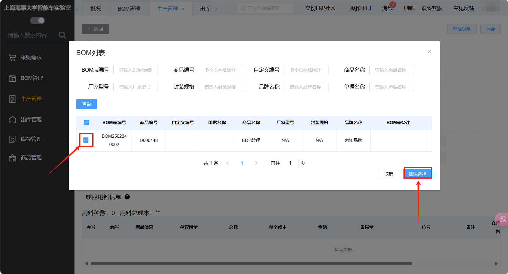
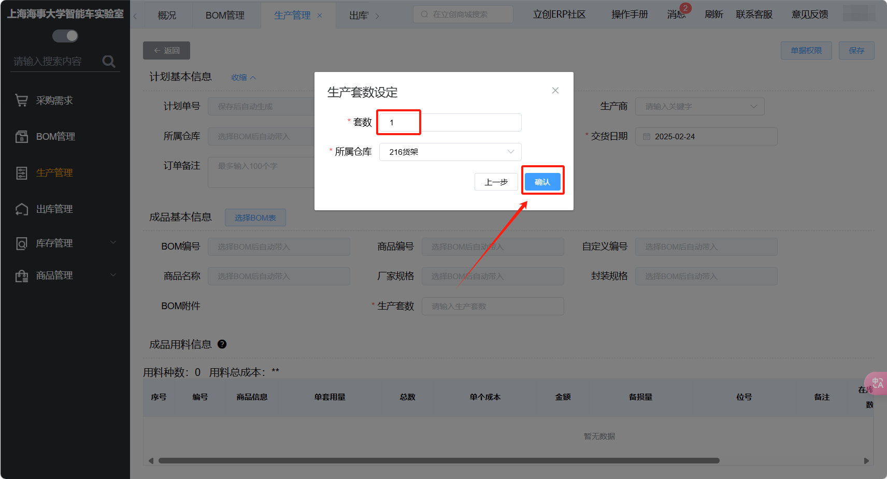
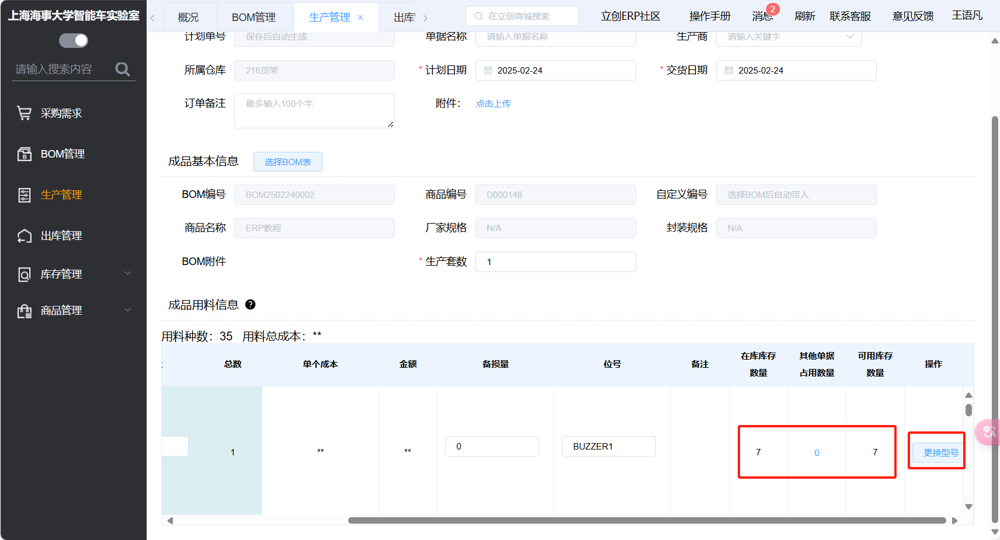
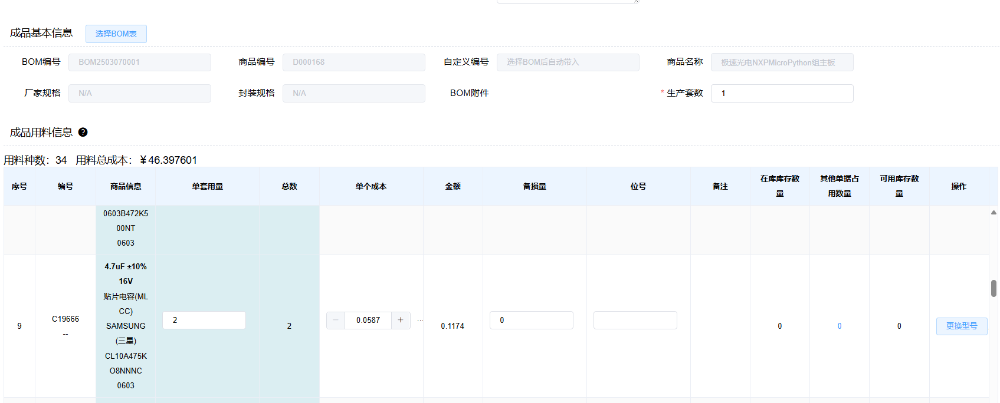
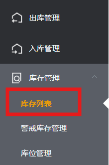
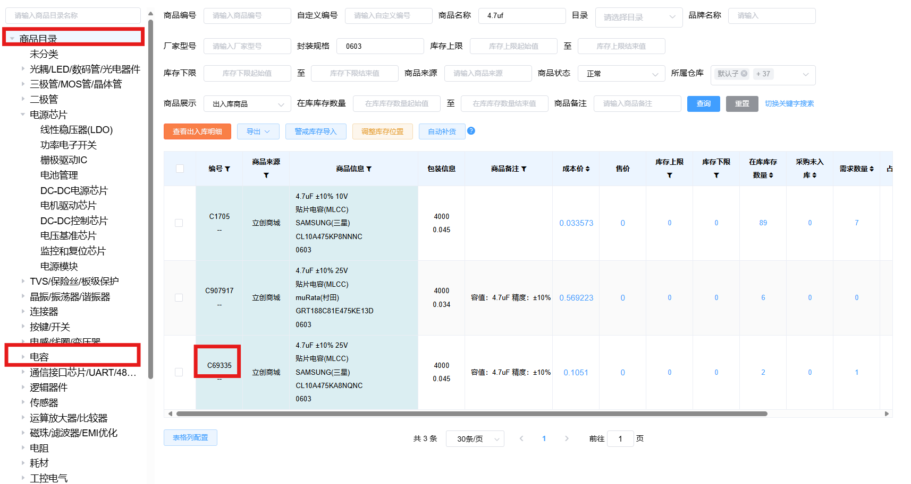
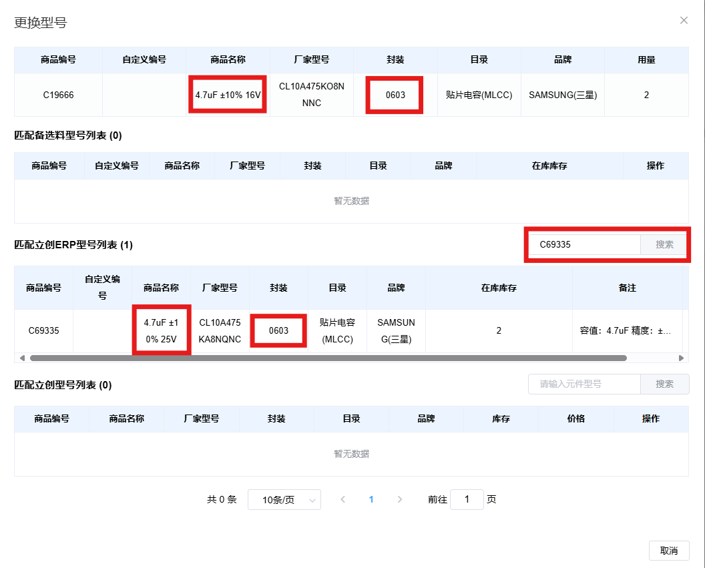
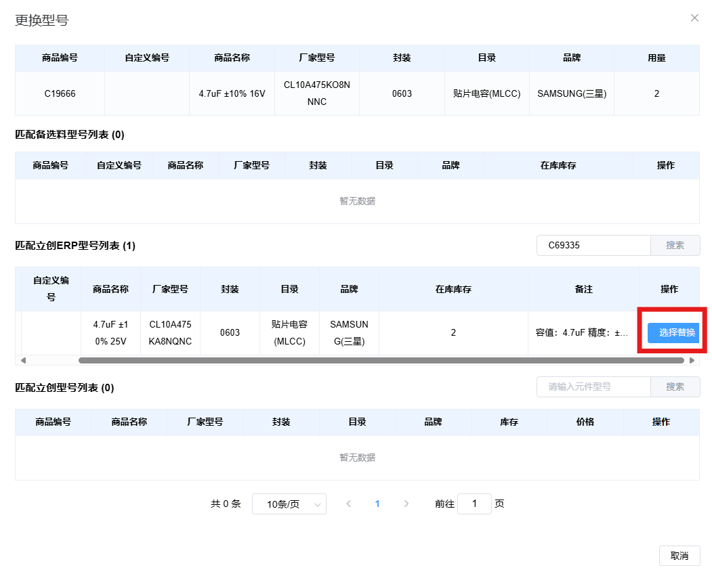

# ERP新建生产计划
生产计划将BOM表中所需的元器件与实验室ERP系统中已有的元器件库存相匹配。

## 选择BOM表

选择您之前上传并审核通过的BOM表，新建一个生产计划。

!!! note
    由于ERP权限设置，您可能只能看到自己上传的BOM表。

## 填写生产套数

按照实际情况填写生产套数，所属仓库请选择216货架。

!!! note
    生产套数会影响后续出库的元件数量，如果准备分多天焊接多块PCB，建议生产套数只填写一块，随后使用再次生产功能，以免造成混乱。

## 匹配元件

您在设计PCB时选择的元件不一定与我们库存中已有的元件完全一致（例如厂家不一致，会造成立创商城编号不一致），此时不要着急于提交采购，库中可能有相同的元件。

**在库库存数量**表示ERP库中实际有的元件数量，**其他单据占用数量**表示其他未出库的生产计划占用的元件数量（ERP系统会为未出库的生产计划预留库存数量），**可用库存数量**表示我们实际可以用的数量，我们需要重点关注此数量。若可用库存数量为零，我们需要先去**库存管理**中寻找库中已有的相同的元件，并点击**更换型号**，替换成一个库中有的元件。

## 更换型号

一些常见规格的电阻、电容、IC，大概率在实验室ERP系统中已有库存，例如图中的电容。

我们在寻找相同元件时，需要关注信息有元件数值，封装。以图中的电容为例，容值为4.7uf，耐压值为16V，封装为0603。

要查询ERP系统中已有的库存，我们需要选择**库存管理**侧栏，点击**库存列表**

!!! tip
    由于ERP权限设置，您的侧边栏可能与图中不相同。

在库存列表中，左边栏为商品分类，若选中类别，则仅会筛选选中类别中的元件。例如图中我们想要查找电容，则需要选中电容类别或是选中商品目录（在所有类别的商品中筛选），如果选中了电源芯片类别，那就会找不到电容元件。

商品名称在一般情况下填写想要寻找的元件参数，封装填写需要的封装（关于各种封装的概念需要同学们自己了解，在此不做介绍）

我们可以看到图中筛选出了三个4.7uf，0603封装的电容，此时还要关注一下其他参数，在本例中则是电容的耐压值，可以看到有10V和25V的两个选择。在设计中，我们选用了耐压值为16V的电容，故此次可以选择耐压值为25V的村田或三星电容。

随后我们复制编号，回到生产管理界面，找到我们要更换的元件，点击**更换型号**，进入更换型号页面。

在更换型号页面，将刚才复制的编号粘贴至**匹配立创ERP型号列表**旁的搜索栏，随后点击搜索。我们可以再次确认元件是否可以被替换。

在确认替换元件正确后，右滑下方的滑条，点击选择替换。

## 完成新建生成计划

在完成元件替换后（如果需要采购实验室ERP中没有库存的元件，请不要随便替换元件，保持原来的元件），请点击保存，我们会审核生产计划。

在审核的过程中，我们会完成元件的采购。
