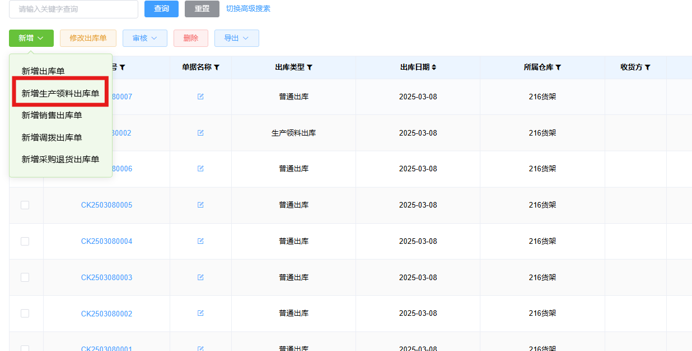
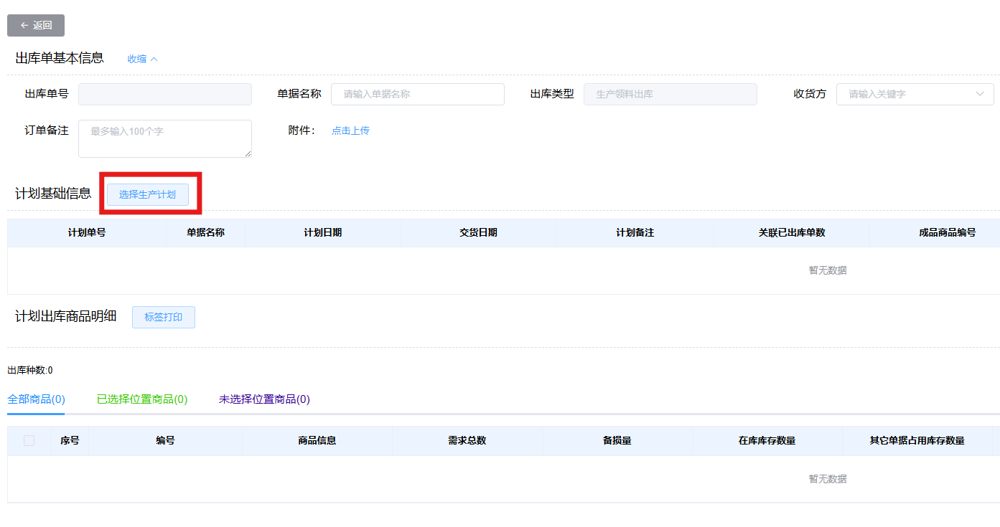
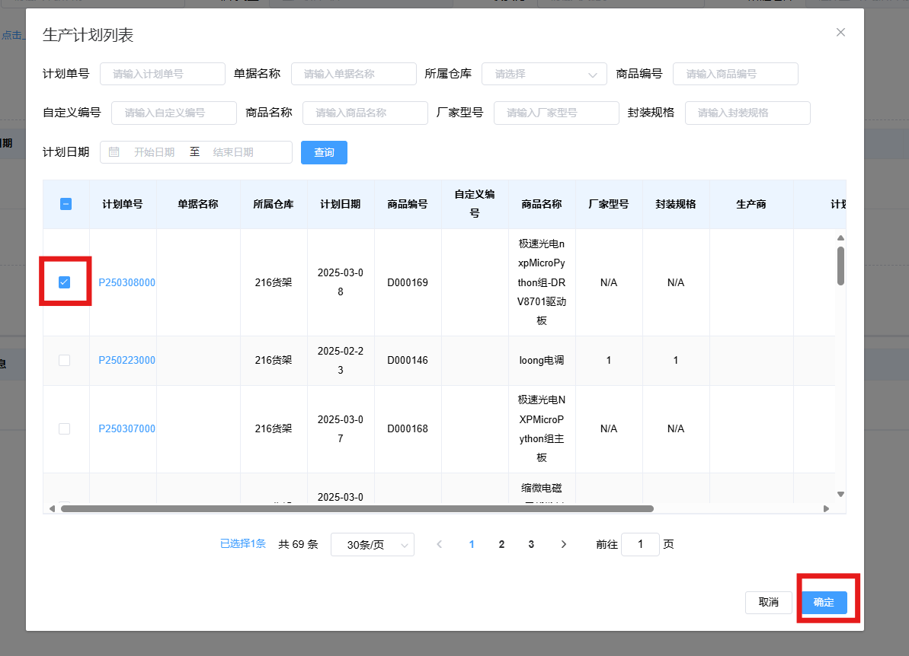
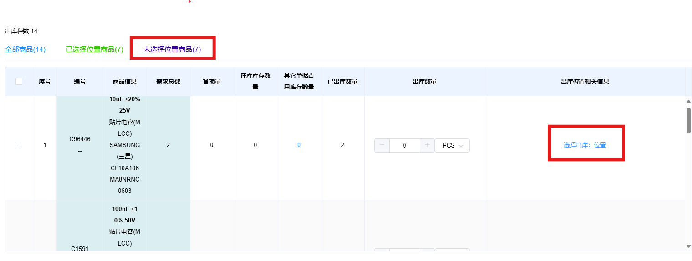
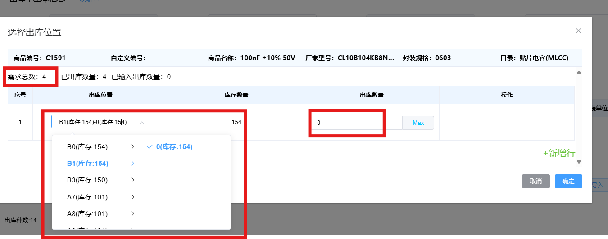
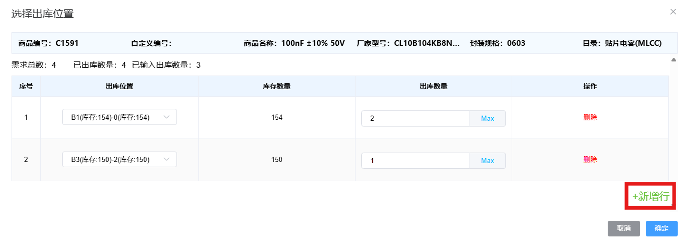

# ERP新建出库单

## 以生产计划出库

进入**出库管理**页面，点击**新增**按钮，随后点击**新增生产领料出库单**

在新增出库单页面，点击**选择生产计划**，选择一个审核通过的生产计划。

我们需要选择元件的出库位置，同一个元件可能存放在多个库位，点击**未选择位置商品**就可以筛选出没有选择出库位置的商品，随后点击**选择出库:位置**

在选择出库位置页面，我们需要选择出库库位以及数量，出库位置的下拉菜单会列出所有存放该元件的库位，以及该库位中的库存数量，出库数量会自动填入需求数量（在例子中由于选择了已经出库的生产计划，故自动填入数量为0）。

在遇到一个库位中的库存数量小于需求数量时，点击右下角**新增行**，可以选择两个库位出库该元件。

在完成所有未选择位置商品的库位选择后，点击**保存**提交审核。