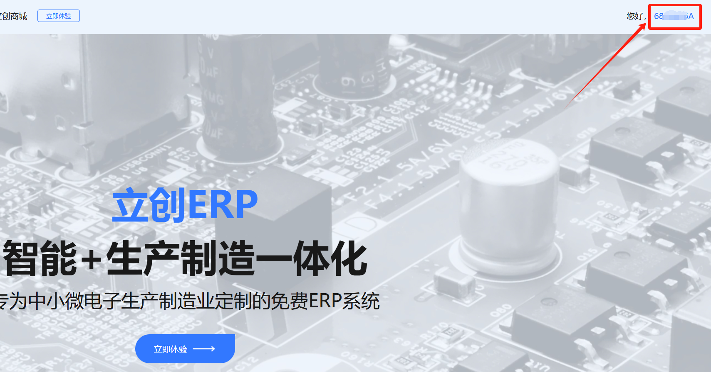
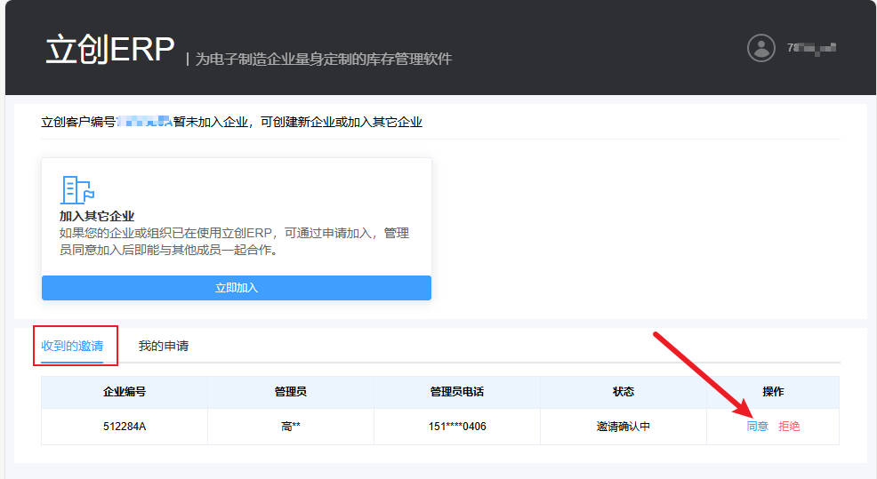

# 加入我们在立创ERP上的企业
本文档旨在引导您寻找到自己的嘉立创客编，并加入上海海事大学智能车实验室的ERP系统。

!!! Tip
    ERP系统用于管理实验室中的电子元器件，避免多次采购造成浪费。

## 登录立创ERP并寻找到你的客编
 [立创ERP官网](https://www.szlcsc.com/lcerp.html)

!!! Tip
    嘉立创集团旗下的网站使用统一认证服务，如有立创商城等其他子网站的账号，可使用相同账户直接登录立创ERP系统。

登录成功后，您可以在页面的右上角查看到当前账户的客户编号，我们需要使用这个客户编号邀请您加入上海海事大学智能车实验室的ERP。

## 将立创客编发送给我们
[Teams-嘉立创客编收集](https://forms.office.com/Pages/ResponsePage.aspx?id=xFolimbnY06_UjYBhg87QD2B6QrfzedJjwbX8lYDsGVUQjhOTE00VkxXMDBQMDZVUDJBMU1HODBFUSQlQCN0PWcu)

!!! Tip
    我们可能会需要一些时间处理邀请，请耐心等待。

## 接受邀请并加入我们的ERP
在我们邀请您之后，您可以进入ERP系统并接受我们的邀请。

