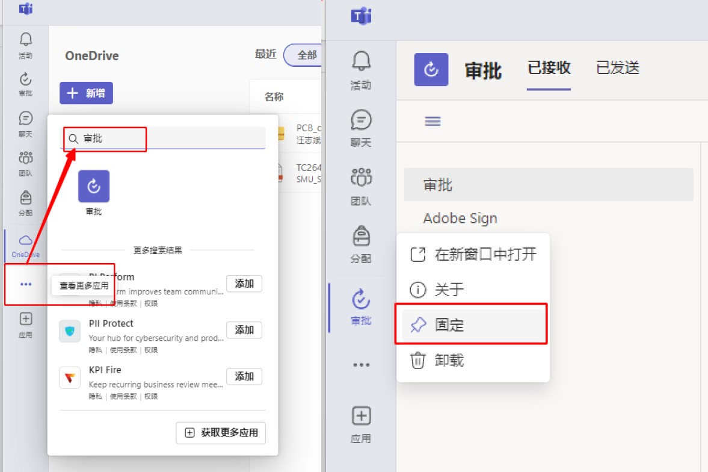
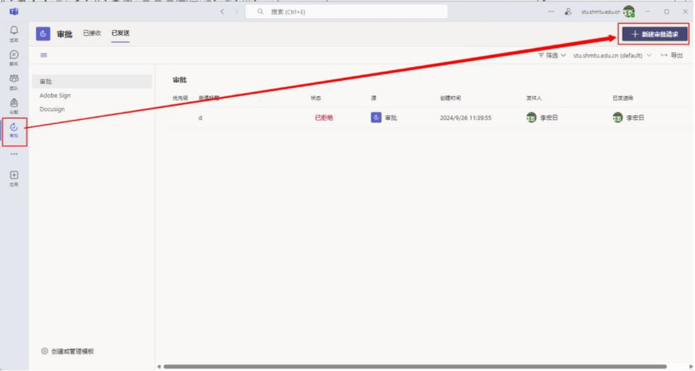
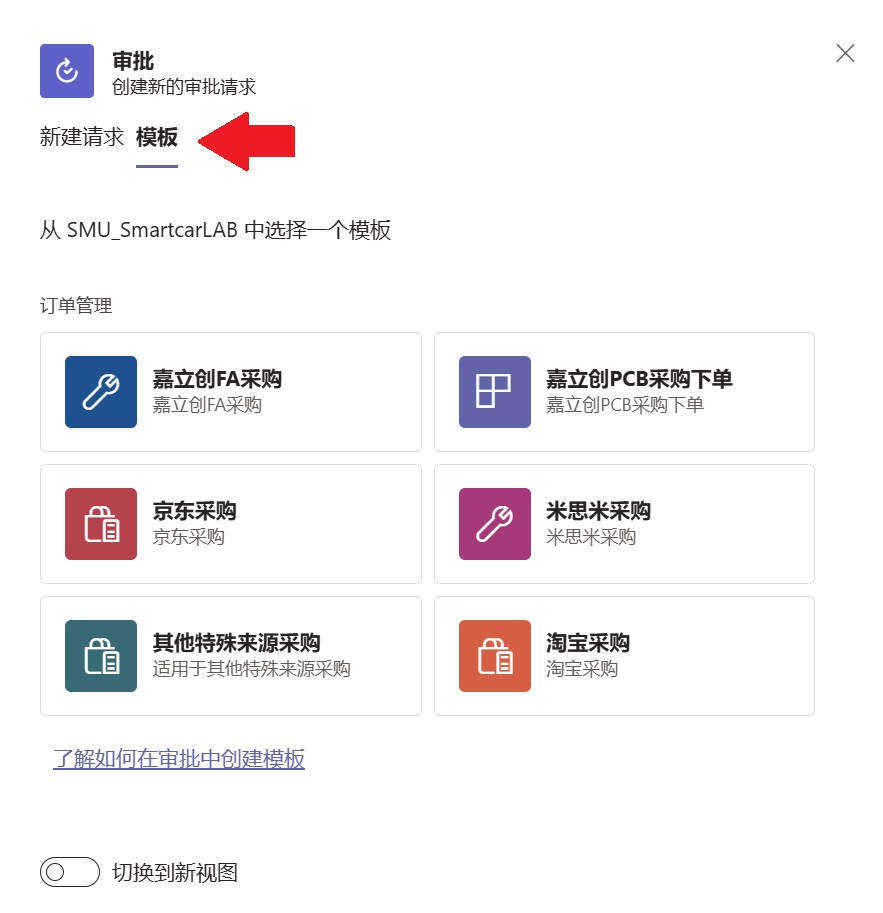
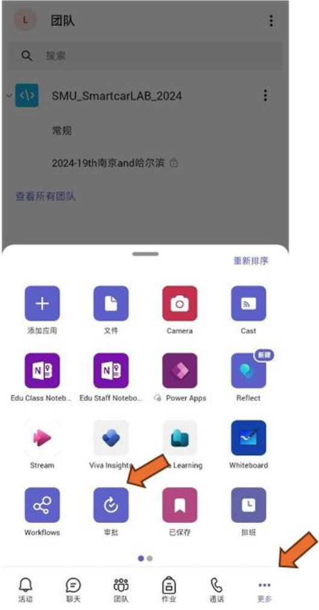
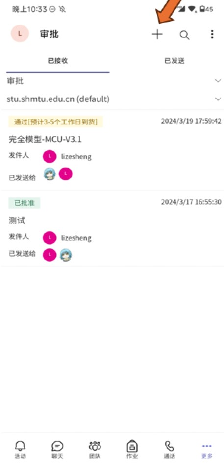

# Microsoft Teams 审批操作指南
上海海事大学智能车实验室采用Microsoft Teams中的审批功能进行采购信息的统计和审批，这大大减小了采购负责同学的工作量，杜绝了采购信息不同步造成的错漏迟现象。所有采购除 [立创商城元器件采购] 使用 [立创ERP] 系统完成外均在Microsoft Teams审批中完成。**请不要通过及时聊天工具向负责采购的同学发送采购需求**，未通过上述方式提交的采购需求不被视为正式采购需求并可能不予处理。

## 在Microsoft Teams软件中创建审批请求
### 桌面版Microsoft Teams软件
要在Microsoft Teams桌面版软件中创建审批请求，请在软件左侧的导航栏中选择更多`...`选项，并在搜索框中键入`审批`，在右侧搜索结果中选择`审批`应用。当审批应用出现在导航栏中时，您可以右键点击它，选择“固定”操作，以便后续使用更加便捷。   

  

要创建审批请求，请进入`审批`应用然后点击右上方的`新建审批请求`

  

在弹出的界面中选择`模板`，并根据您采购的形式选择对应的表单进行填写。  

  

### 移动版Microsoft Teams软件
使用移动版Microsoft Teams软件进行审批请求的操作与桌面版类似，首先请在您的手持设备上下载Microsoft Teams软件。  

要在您的手持设备上下载Microsoft Teams软件，请访问您的手持设备制造商提供的应用商店。  

!!! note
    若您的手持设备制造商提供的应用商店中未包含Microsoft Teams应用，请尝试此 [替代链接](https://play.google.com/store/apps/details?id=com.microsoft.teams&pcampaignid=web_share
    )。此替代链接指向Google Play商店，要了解如何在您的手持设备上启用Google Play服务，请咨询您的手持设备制造商。

在您的手持设备上的Microsoft Teams应用程序正常启动后，选择底部导航栏中的更多`...`选项，并定位到`审批`应用，轻触应用图标以启动`审批`应用。  

  

要新建审批请求，在应用顶部选择`+`功能，后续操作与桌面端的新建审批请求类似。  

  

## 特殊审批附件的使用
为了方便采购信息的统计，目前`嘉立创FA采购`和`米思米采购`审批请求需要请求发起人使用特定的附件模板来上传采购需求信息，相应的附件模板可以在 [文件下载](https://www.smuscl.org/download/) 中找到。

!!! warning
    对于需要使用特殊附件模板的审批请求，不使用或使用错误的附件模板将被驳回。

## Before You Start

!!! warning
    在创建审批请求时，请务必选择对应的审批模板，错用审批模板的请求将被驳回。

!!! warning
    采购审批操作涉及到实际的资金支出，在发送审批请求前您应该确认请求的必要性和正确性，审批请求一经通过原则上无法撤回，上海海事大学智能车实验室有权利要求申报了错误请求的个人负担可能出现的经济损失。

