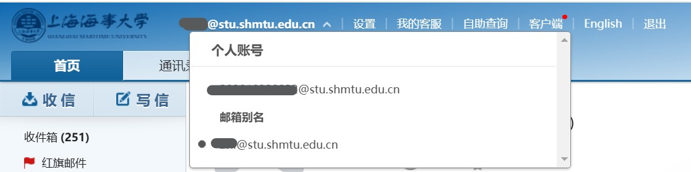
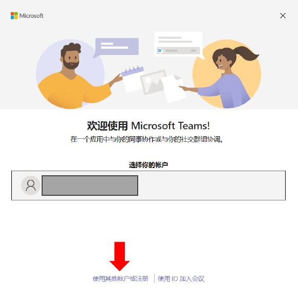
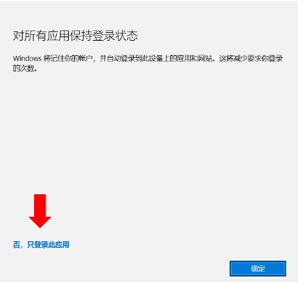
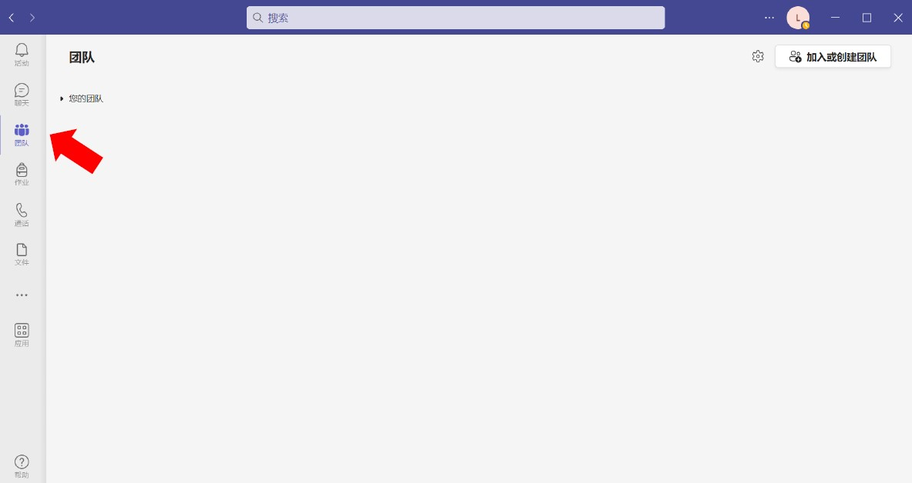
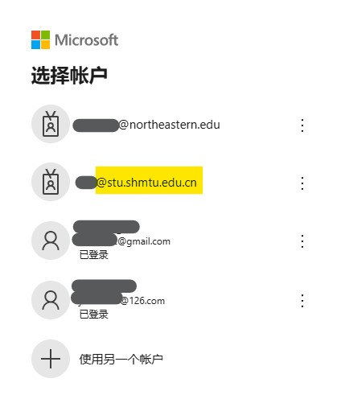

# Microsoft Teams 注册指南
本文档旨在引导您注册并正确加入上海海事大学 Microsoft Azure 域并加入上海海事大学智能车实验室Teams团队。

!!! note
    如果您先前使用过 Microsoft Teams 软件，请注意只要您用于注册Microsoft账户的邮箱域名不是`shmtu.edu.cn`或`stu.shmtu.edu.cn`，就无法正确加入上海海事大学的 Microsoft Azure 域，请参照本文档重新完成注册。

## 检查教育邮箱
要注册属于上海海事大学 Microsoft Azure 域的 Microsoft 账户，您必须使用域名为`shmtu.edu.cn`或`stu.shmtu.edu.cn`的邮箱进行注册，即学校提供的教育邮箱。如您是初次使用学校提供的教育邮箱，请按以下步骤确认您能够正常访问您的邮箱。
### 登录您的邮箱
导航到[上海海事大学数字平台](https://portal.shmtu.edu.cn/)，登录后点击页面左侧导航窗格中的[学生邮箱](http://mail.stu.shmtu.edu.cn/)前往学生邮箱登录页面，输入登录信息进行验证。

!!! tip
    如登录遇到问题，请参见数字平台学生邮箱链接下方的默认账户和找回密码说明。

成功登录后，您可以在页面的左上角查看到您的邮箱地址别名，2023级及以后的学生已经由信息化办公室自动添加了邮箱地址别名，您可以单击您的邮箱地址来查看别名，除了由学号作为邮箱地址外，还存在一个别名地址，一般是由您的姓名拼音构成，您可以点击来选择任一邮箱地址作为您的邮箱地址，这两个地址共享一个收件箱。

!!! Fun_Fact
    如果您的拼音邮箱地址后跟随有学号数字，说明学校中有与您重名的用户（不一定同字但是同音）。

!!! Note
    自2023学年起信息化办公室已经为全部学生用户自动添加了姓名全拼作为邮箱别名，因此不再受理自定义邮箱别名的请求，请勿发送邮件申请自定义邮箱别名。

至此您已经掌握了如何访问自己的学生邮箱，请记住学生邮箱可以给您带来许多优惠，比如申请教育版的优惠软件，使用`.edu`域名的邮箱也是在学术交流中展现自己专业性的有效方式。<del>求求你不要再用qq邮箱了</del>  
### Optional-将邮箱添加到邮件客户端
如果您希望将学校邮箱添加到第三方邮件客户端例如 Outlook, Gmail等支持IMAP/SMTP服务的邮件客户端，请参照 [网易企业邮箱客户端配置手册](https://qiye.163.com/doc/%E5%A6%82%E4%BD%95%E8%BF%9B%E8%A1%8C%E5%AE%A2%E6%88%B7%E7%AB%AF%E8%AE%BE%E7%BD%AE.pdf)。要获取我校教育邮箱的IMAP/SMTP服务器地址，请访问 [网易企业邮箱服务器地址查询](https://qiye.163.com/help/client-profile.html)。

!!! tip
    由于信息化办公室的安全策略要求，学校邮箱的登录密码会在一定时间后自动过期并要求更新新的密码，如果在绑定客户端后更新了密码则会导致需要重新配置邮件客户端。如要避免这种情况可以使用网易企业邮箱的 [客户端授权码] 功能，具体使用方法详见您的邮箱中 [设置-客户端设置] 一栏

## 注册Microsoft账户并登录Teams
导航到[Microsoft365教育](https://www.microsoft.com/zh-cn/education/products/office)，选择 [开始使用]，根据页面向导完成注册，**注意使用您的学校教育邮箱作为邮箱地址，国家和地区选择中国**，注册完成后您的账户将自动加入上海海事大学Azure域。在填写姓名时请填写您的真实姓名，以便我们审核您的团队加入请求。  

注册完成后，请访问 [下载Microsoft Teams](https://www.microsoft.com/zh-cn/microsoft-teams/group-chat-software/) 来下载并安装Microsoft Teams。安装完成后的Microsoft Teams应该位于开始菜单中字母M列表下，启动Microsoft Teams，您应该看到以下欢迎页面，其中自动识别的账户为您当前系统中登录的Microsoft账户，**不要选择这个账户**并点击下方的 [使用其他账户登录]。  

  

使用您刚刚使用学校教育邮箱创建的Microsoft账户进行登录，如果看到如下 [对所有应用保持登录状态] 的提示，请选择 [否，仅登录此应用]，否则此账户将替代您计算机上所有已经登录Microsoft账户的应用，可能导致Office365和Xbox订阅产生问题。  

  

## 加入团队
您应该已经成功登录了Microsoft Teams应用并正确注册于上海海事大学Microsoft Azure域中，请检查您的Microsoft Teams应用程序，其左侧导航栏中应该具有 [团队] 选项，这证明您的操作正确，如果找不到 [团队] 选项卡，请重新确认您是否使用了正确的学校教育邮箱进行注册和登录。

请您使用 [加入团队](https://teams.microsoft.com/l/team/19%3AkiiwzjyyDdRLjFWsQUPwawHVVMaJ7PfYCcAd_ScaIQE1%40thread.tacv2/conversations?groupId=0ae9813d-cddf-49e7-8f06-d7f25603b065&tenantId=8a255ac4-e766-4e63-bf52-3601860f3b40) 链接来加入团队，注意如果浏览器弹出如下的选择Microsoft账户的页面，请选择**使用学校教育邮箱注册的账户**，如果账户未列出，请选择**使用另一个账户**并手动输入邮箱地址。

  

## 等待管理员验证
恭喜您已经完成了所有需要的步骤，现在请等待管理员验证通过您的团队加入请求，如果您比较着急请直接前往216找一位老登线下真实。

!!! tip
    由于未知的原因，加入Teams团队的请求在发出后会立即显示在团队管理员的消息中，但是无法立即进行同意操作，如果点击同意后产生报错，请尝试等待5-10分钟再次尝试，这一般都可以解决问题。

